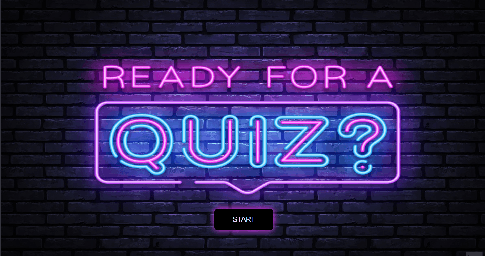

# Quiz-App-Javascript

## Project Overview

Quiz App was created for front-end newbies to improve their JS knowledge by practicing.   
It is easy to use. To start to quiz-app, you only click on the start button. Then select an option that you think correct.   
If you don't know the answer, you can use the show answer button.   
At the end of the quiz, you will see the result page. On the upper left corner you will see you score, and ont he upper right corner you will see the timer.

## Built With
---

  
  
  
 

 ## Installation Instructions
 1. Clone the repository
 2. Open your code editor
 3. Go to index.html file and open it with live LiveServer

 ## Contributing
 Contributions are very welcome. If you have any suggestion to make it better, you are kindly requested to fork repo and create a pull request.
 1. Fork the Project
 2. Create your Feature Branch (git checkout -b feature/AmazingFeature)
 3. Commit your Changes (git commit -m 'Add some AmazingFeature')
 4. Push to the Branch (git push origin feature/AmazingFeature)
 5. Open a Pull Request

 ## Quiz App Demo
 